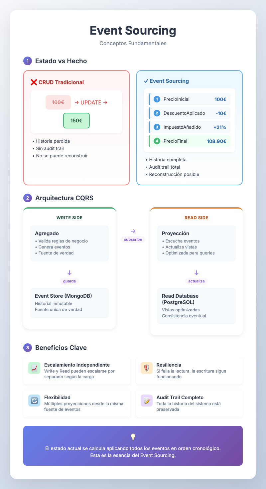
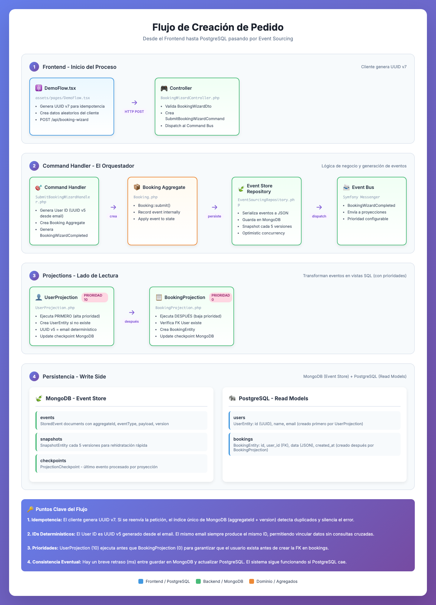
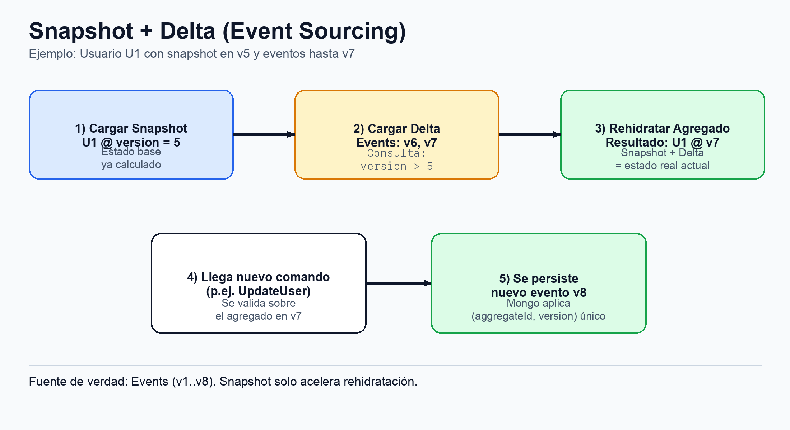

# Event Sourcing: La Arquitectura de la Verdad

Event Sourcing cambia la forma en la que almacenamos la información. En un sistema tradicional, la base de datos solo guarda el estado actual de las cosas (el resultado final). En Event Sourcing, la base de datos guarda la historia: una secuencia de eventos inmutables que describen cada cambio que ha ocurrido.

Para entenderlo con una analogía:

- **Sistema Tradicional**: Es como una pizarra donde borramos el valor viejo para escribir el nuevo. Solo vemos lo que hay escrito ahora.
- **Event Sourcing**: Es como un libro de contabilidad (ledger) donde cada línea es una entrada nueva que nunca se borra. El "saldo actual" es simplemente el resultado de sumar todas las líneas del libro.

---

## Arquitectura del Proyecto

El proyecto sigue un enfoque **API-First** con un frontend en **React** desacoplado del backend. La comunicación se realiza a través de una API HTTP, que actúa como la interfaz principal del sistema.

Utilizamos **Domain-Driven Design (DDD)** para organizar el código en torno al negocio. Los **Agregados** son clave para mantener la integridad de las reglas. La **Arquitectura Hexagonal** asegura que la lógica de dominio sea independiente de la infraestructura, usando "puertos" y "adaptadores".

La arquitectura se basa en **CQRS (Command Query Responsibility Segregation)**, con una clara separación entre:

- **Lado de Escritura (Event Store en MongoDB)**: Recibe comandos y produce eventos, garantizando la integridad de los datos.
- **Lado de Lectura (Vistas en PostgreSQL; checkpoints en MongoDB)**: Proporciona vistas optimizadas de los datos para consultas rápidas.

La persistencia se implementa mediante **Event Sourcing**, donde almacenamos la secuencia completa de eventos que representan cada cambio. Esto ofrece un historial inmutable y reconstruible, y una completa trazabilidad del sistema.

Lectura didáctica útil para este diseño:

- **Escritura (más cerca de ACID)**: Priorizamos la integridad de la decisión de negocio y del evento persistido.
- **Lectura (más cerca de BASE)**: Priorizamos disponibilidad y rendimiento, aceptando desfases temporales entre MongoDB y PostgreSQL.

Esta combinación de patrones fomenta un sistema robusto, escalable y con responsabilidades bien definidas.

---

## 1. Conceptos Fundamentales

### El Estado vs. El Hecho

La diferencia principal radica en qué consideramos "la verdad" en nuestro sistema:

- **El Estado (CRUD)**: Es el valor actual. Si un usuario cambia su email, ejecutamos un `UPDATE` y el email anterior desaparece. Hemos perdido la historia y el contexto.
- **El Hecho (Event Sourcing)**: Es el evento que ha ocurrido. Guardamos un registro que dice `UserEmailChanged`. Este hecho es inmutable: no se puede cambiar ni borrar porque ya sucedió en el pasado.

### El Agregado y la Proyección

Para que este sistema sea eficiente, dividimos las responsabilidades:

- **Agregado (Escritura)**: Es el encargado de tomar decisiones. Recibe una petición, valida que cumpla las reglas de negocio y, si todo es correcto, genera un nuevo evento. Su fuente de verdad es el Event Store (en este proyecto, MongoDB).
- **Proyección (Lectura)**: Es una vista de los datos optimizada para ser consultada. Escucha los eventos que genera el Agregado y actualiza tablas tradicionales (en este proyecto, PostgreSQL) para que la aplicación pueda mostrar la información rápidamente.

---

## 2. Recorrido Técnico: Anatomía de una Reserva

Para entender cómo funciona el sistema, seguiremos el rastro de una operación desde que el usuario pulsa el botón "Generate new booking" en la pantalla de monitorización hasta que el dato aparece en las tablas de consulta.

### Fase 1: Identidad en el Origen (Frontend)

La operación comienza en el navegador (`DemoFlow.tsx`). Antes de realizar la petición POST al servidor:

1.  **Generación de ID**: El cliente genera un UUID v7 para el pedido. Al nacer el ID en el cliente, el sistema adquiere la propiedad de **idempotencia total**: si la petición se repite por un fallo de red, el servidor sabrá que es el mismo pedido.
2.  **Petición**: Se envía un comando con el ID, datos del cliente aleatorios y el presupuesto.

### Fase 2: El Agregado y la Verdad (Write Side)

El comando llega a `SubmitBookingWizardHandler`, que actúa como el guardián de la integridad. El flujo es el siguiente:

1.  **Identidad Determinística**: El sistema ya no pregunta a PostgreSQL "¿existe este usuario?". En su lugar, utiliza un **UUID v5** generado a partir del email del cliente. Esto garantiza que el mismo email siempre resulte en el mismo ID de usuario, permitiendo que diferentes proyecciones vinculen datos sin necesidad de consultas cruzadas entre bases de datos.
2.  **EAFP (Better to Ask Forgiveness than Permission)**: Los Handlers aplican este principio. En lugar de comprobar si un registro existe antes de crearlo (LBYL), intentamos la operación directamente. Si hay una colisión, la infraestructura lanza una `ConcurrencyException` que capturamos silenciosamente, garantizando la idempotencia con el mínimo de lecturas a la DB.
3.  **Rehidratación Optimizada**: El repositorio recupera el estado del Agregado desde **MongoDB**. Gracias a la implementación de **Snapshots por Agregado**, no siempre leemos todos los eventos. Si hay un snapshot reciente, lo cargamos y solo aplicamos los eventos posteriores (el "delta"), minimizando el uso de CPU e I/O.
4.  **Bloqueo Optimista (Control de Concurrencia)**: Se ha eliminado la necesidad de bloqueos pesimistas (`LockFactory`). Confiamos en un índice único en MongoDB (`aggregateId` + `version`). Si dos procesos intentan guardar la misma versión de un objeto, el motor de persistencia bloquea el segundo intento atómicamente.
5.  **Desacoplamiento Total**: El lado de escritura es ahora 100% independiente del lado de lectura. No hay inyecciones de repositorios SQL en los Handlers.

### Fase 3: La Proyección y la Consistencia Eventual (Read Side)

El sistema utiliza proyecciones especializadas para transformar hechos en vistas útiles:

1.  **Garantía de Integridad (Prioridades)**: En arquitecturas SQL con claves foráneas, el orden importa. `UserProjection` tiene asignada una **prioridad alta (10)** en el bus de Symfony, mientras que `BookingProjection` tiene la prioridad por defecto (0). Esto garantiza que, en un flujo síncrono, el Usuario siempre "nazca" en SQL antes de que la Reserva intente referenciarlo.

    **Nota sobre el Escalamiento Asíncrono:** Es fundamental entender que en un entorno de producción con colas de mensajes (donde cada proyección corre en un worker distinto), **las prioridades de Symfony ya no garantizan el orden**. El mensaje del Booking podría procesarse antes que el del Usuario.

    #### Gestión de Fallos: El caso del "Usuario B"

    Imagina una secuencia de eventos: `101 (User A)`, `102 (User B)`, `103 (User C)`. Si el proceso del `User B` falla (ej. por un bug o timeout), ¿qué ocurre con el checkpoint?
    - **Estrategia Dead Letter Queue (DLQ):** El sistema considera que un mensaje ha sido "gestionado" tanto si tiene éxito como si se mueve a una cola de fallos controlada.
    - **Avance del Checkpoint:** Al mover a `User B` a la DLQ, el sistema **permite que el checkpoint avance al 102**. Esto evita el bloqueo total del sistema ("Poison Pill") y permite procesar al `User C` inmediatamente.
    - **Rescate Manual:** Los datos de `User B` no se pierden; quedan en una tabla lateral de la base de datos de infraestructura (`queue-db`) esperando a que un desarrollador los rescate tras corregir el problema.

    #### Técnicas de Resiliencia Aplicadas:
    - **Reintento Inteligente (Smart Retry):** Si una proyección falla porque un dato dependiente aún no ha llegado (condición de carrera), el sistema lanza una `RecoverableMessageException`. Symfony Messenger captura esto y reintenta el mensaje con un retardo exponencial (1s, 2s, 4s...), dando tiempo a que la consistencia eventual se alcance.
    - **Aislamiento de Infraestructura:** Las colas viven en una base de datos PostgreSQL dedicada, separada de los datos de dominio, permitiendo una migración transparente a sistemas como RabbitMQ o Kafka en el futuro.
    - **Consolidación de Proyectores (Atomic Projection):** Crear un único listener que gestione ambas entidades en una única transacción SQL, asegurando el orden correcto de inserción.
    - **Relajación de Constraints (Eventual Consistency):** Eliminar las Foreign Keys físicas en las tablas de lectura, aceptando una inconsistencia temporal de milisegundos en la vista SQL.

2.  **Checkpointing**: Cada proyección guarda su propio "marcador" en MongoDB. Esto permite saber qué evento fue el último procesado con éxito, facilitando la recuperación tras un fallo y asegurando que ningún evento se procese dos veces.
    - Qué es exactamente un checkpoint:
        - Un documento por proyección (ej. `user_projection`, `booking_projection`).
        - Guarda el identificador del último evento aplica con éxito por esa proyección.
        - Vive en la colección `checkpoints` de MongoDB (separado de `events` y `snapshots`).
        - Punto clave: se actualiza en el **Read Side** (al final de un handler de proyección exitoso), **no** en el `save()` del agregado en el Write Side.
    - Para qué se usa en operación:
        - **Reanudación tras caída:** al reiniciar, la proyección continúa desde su último checkpoint.
        - **Idempotencia operativa:** evita reprocesar trabajo ya confirmado por esa proyección.
        - **Observabilidad:** permite inspeccionar si una proyección está al día o atrasada.
    - Ejemplo sencillo:
        - `user_projection` procesa correctamente `E1`, `E2`, `E3` y actualiza su checkpoint a `E3`.
        - Durante `E4` hay un fallo (timeout SQL) y el proceso se detiene.
        - Al recuperarse, el sistema lee checkpoint `E3` y reanuda desde `E4` (no vuelve a ejecutar `E1..E3`).
        - Resultado: recuperación más rápida y sin duplicar trabajo ya confirmado.

3.  **Polimorfismo en Lectura (Generalista vs Especialista)**:
    - `ProductProjection` (Generalista): Gestiona el catálogo comercial (nombres, precios, monedas).
    - `MenuProjection` (Especialista): Gestiona el detalle técnico del producto (platos, descripción).
    - Esta separación permite que un solo evento de escritura alimente múltiples tablas optimizadas sin modificar la estructura comercial base.

---

## 3. Optimización Avanzada: El Ciclo de Vida del Snapshot

Reconstruir un estado a partir de miles de eventos puede ser costoso. Hemos implementado una estrategia profesional de **Snapshotting**:

1.  **Snapshots por Agregado**: Cada objeto de negocio (Booking, User, Product) decide cuándo necesita un snapshot (ej. cada 5 eventos en esta demo).
2.  **Persistencia Atómica**: El snapshot guarda el estado interno completo del objeto en una colección dedicada en MongoDB, indexada por ID y Versión.
3.  **Evolución hacia el Segundo Plano**: Aunque actualmente el snapshotting ocurre durante el `save()` para este POC, en sistemas de gran escala esta tarea se delega a procesos asíncronos o tareas programadas (**CRON**). Esto permite que el usuario reciba una respuesta instantánea mientras el sistema se optimiza en segundo plano.

Nota didáctica importante:

- El threshold de snapshot se aplica por **agregado** (mismo `aggregateId`), no por número global de eventos del sistema.
- Por eso, crear 5 bookings distintos (5 IDs distintos con 1 evento cada uno) no genera snapshots.
- En cambio, un mismo usuario que acumula 5 eventos sobre su propio `aggregateId` sí dispara snapshot.

---

## 4. Resiliencia y Consistencia Eventual

La separación entre la escritura y la lectura introduce la **Consistencia Eventual**: un breve periodo de tiempo (milisegundos) en el que el evento ya existe en MongoDB pero aún no se ha reflejado en PostgreSQL.

### ACID vs BASE en esta arquitectura

En esta implementación, no hablamos de "todo ACID" o "todo BASE", sino de un equilibrio:

- **En el Event Store (MongoDB)**: se protege la coherencia del flujo de escritura (hechos inmutables + control de concurrencia optimista).
- **En las proyecciones (PostgreSQL)**: se acepta una convergencia eventual de la vista para ganar resiliencia y escalabilidad operativa.

### Gestión de Fallos de Infraestructura

En la pantalla **Architecture Monitor**, podemos simular qué ocurre cuando el sistema de lectura falla:

1.  **Escenario**: Desactivamos los proyectores de datos.
2.  **Resultado**: Los usuarios pueden seguir creando pedidos normalmente porque MongoDB (la escritura) sigue funcionando. Sin embargo, los nuevos pedidos no aparecen en las listas de la web porque PostgreSQL (la lectura) no está recibiendo las actualizaciones.
3.  **Ventaja**: El negocio no se detiene. Los datos están a salvo y la "verdad" está guardada, aunque la visualización esté temporalmente retrasada.

### El Proceso de Replay (Recuperación)

Si la base de datos de lectura se pierde o queremos cambiar su estructura, podemos usar el historial de eventos:

1.  **Vaciado**: Se borran las tablas de PostgreSQL.
2.  **Re-procesamiento**: El sistema lee todos los eventos guardados en MongoDB desde el primer día.
3.  **Restauración**: Los proyectores vuelven a ejecutar cada evento en orden, reconstruyendo la base de datos de PostgreSQL exactamente como estaba, o con un nuevo formato si fuera necesario.

### Detalle exacto: ¿cuándo usamos Snapshots y cuándo Events?

Aquí hay dos recorridos distintos y es importante no mezclarlos:

1.  **Recuperación del estado de un agregado (Write Model, MongoDB)**
    - Ocurre cuando un handler necesita cargar un agregado para decidir (por ejemplo, actualizar un usuario).
    - Algoritmo:
        - Busca el último snapshot de ese `aggregateId`.
        - Si existe, reconstruye desde snapshot (versión N) y aplica solo eventos posteriores (`version > N`).
        - Si no existe snapshot, reconstruye desde todos los eventos de ese agregado.
    - Ejemplo numérico explícito:
        - Estado real en `events`: versiones `1..7` del usuario `U1`.
        - Último snapshot disponible: `version=5` para `U1`.
        - Rehidratación para procesar un nuevo comando:
            - Carga snapshot `v5`.
            - Lee solo eventos con `version > 5` (o sea `v6` y `v7`).
            - Aplica ese delta y queda en estado/version real `v7`.
        - Si el comando genera un evento nuevo, se persiste como `v8`.

    - Resumen: **Snapshot + Delta de Events** (por agregado).

2.  **Regeneración de proyecciones SQL (Read Model recovery)**
    - Ocurre en el flujo de `clear transactional + rebuild from mongo`.
    - Algoritmo:
        - Limpia tablas de lectura en PostgreSQL.
        - Limpia checkpoints de proyección.
        - **Seed rápido desde snapshots** (actualmente para usuarios): inserta el último estado conocido por agregado.
        - Reproduce solo el **delta de eventos** posterior al snapshot sembrado.
        - Para agregados sin snapshot, reprocesa su stream completo.
    - Resumen: **Snapshot seed + Event delta** para acelerar reconstrucción sin perder consistencia.

#### Orden temporal en replay: regla crítica

Para que el estado final sea correcto, los eventos deben reprocesarse en orden temporal ascendente y de forma determinista:

- `occurredOn ASC`
- `aggregateId ASC`
- `version ASC`

Si se reprocesan al revés (descendente), un evento antiguo puede pisar un estado más nuevo (por ejemplo, terminar en `bb2` en vez de `bb5` para el mismo email).

---

## 5. Decisiones de Ingeniería y Casos de Borde

### Idempotencia en Proyecciones

Es posible que un proyector reciba el mismo evento más de una vez debido a reintentos de red. El sistema está diseñado para manejar esto: si el proyector intenta crear un registro que ya existe en PostgreSQL, simplemente lo ignora (usando bloques try-catch o verificaciones de existencia) y continúa.

### ¿Dónde consultar la información?

Es vital entender qué base de datos usar según el objetivo:

- **Para mostrar datos (Lectura)**: Se usa PostgreSQL. Es extremadamente rápido para realizar búsquedas y filtros complejos.
- **Para validar reglas (Negocio)**: Debemos consultar el estado que ofrece el Agregado (rehidratado desde MongoDB), ya que es la única fuente que garantiza tener el dato exacto al milisegundo.

### Mención Especial: ¿Qué hacer cuando cambia el esquema de base de datos?

La estrategia recomendada para evitar dolor es **Expand -> Migrate -> Contract**:

1. **Expand (seguro):** añadir estructura nueva sin romper la antigua.
    - Ejemplo: añadir `users.address` como nullable.
2. **Migrate (convivencia):** el código nuevo escribe/lee el campo nuevo, pero sigue funcionando si viene vacío (eventos antiguos).
3. **Contract (limpieza):** cuando todo está estable, se elimina lo legacy en una iteración posterior.

#### Ejemplo didáctico real de esta demo

- Antes: `UserRegistered` guardaba `name` y `email`.
- Cambio: se introduce `address` opcional.
- Resultado buscado:
    - usuarios nuevos pueden traer `address`;
    - eventos antiguos siguen siendo válidos (porque `address` es opcional);
    - si vaciamos PostgreSQL y hacemos **Rebuild from Mongo (Events)**, la reconstrucción no se rompe.

La clave es que el **histórico no se reescribe en bloque**: se diseña compatibilidad hacia atrás en eventos/proyecciones y se deja que el replay reconstruya el estado final.

---

## 6. Anexo: Cómo se calcula la versión del Agregado (y cómo evita duplicados)

Este proyecto aplica **concurrencia optimista** por agregado. No usa bloqueos pesimistas ni contadores globales en memoria para coordinar escrituras entre peticiones.

### Idea clave en una frase

- La versión "de verdad" vive en el **Event Store (MongoDB)**.
- La memoria del proceso solo vive durante la request.
- El control final lo hace Mongo con índice único por `(aggregateId, version)`.

### WRITE vs READ (la confusión más habitual)

- **Al guardar (WRITE)**: no se hace `SELECT MAX(version)` antes de insertar.
- **Al cargar (READ/rehidratación)**: sí se consulta MongoDB para reconstruir el agregado (snapshot + eventos).
- **Tras reiniciar servidores**: no se pierde la versión real, porque se recupera al rehidratar desde MongoDB.

Piensa en esto:

- Guardar = "intento escribir el siguiente evento con una versión concreta".
- Cargar = "reconstruyo en qué versión iba este agregado".

### Regla exacta usada al persistir en este código

En `EventSourcingRepository::save()`:

`versionBase = aggregate.getVersion() - count(aggregate.getRecordedEvents())`

Después, por cada evento nuevo:

1. `versionBase++`
2. esa versión se asigna al `StoredEvent`
3. se hace `insertOne` en MongoDB

Si Mongo devuelve duplicado (`11000`) por el índice único `(aggregateId, version)`, se traduce a `ConcurrencyException`.

### Caso real de esta demo: `BookingWizardCompleted`

Para `Booking`, el `aggregateId` es el `bookingId` que manda el cliente.

Flujo cuando llega una petición nueva:

1. El agregado `Booking` nace en versión `0`.
2. `Booking::submit(...)` genera 1 evento (`BookingWizardCompleted`) y en memoria queda versión `1`.
3. Al guardar, se intenta insertar `(aggregateId=bookingId, version=1)`.

Si llega la **misma petición** otra vez (mismo `bookingId`):

1. Se vuelve a construir un agregado nuevo en memoria.
2. Se vuelve a intentar insertar `version=1` para ese mismo `aggregateId`.
3. Mongo rechaza por índice único.
4. El handler captura `ConcurrencyException` y sale en silencio (idempotencia EAFP).

Conclusión para este caso de uso actual:

- Para un `bookingId` concreto, en eventos de `Booking` queda como máximo la versión `1`.
- El reintento **no** se convierte en versión `2`.

### ¿Y si entran dos requests a dos servidores distintos?

Mismo resultado: ambos servidores pueden intentar escribir `(aggregateId, version=1)` casi a la vez, pero solo uno gana.

- Nodo A inserta primero: OK.
- Nodo B inserta después: duplicado de clave.
- Nodo B recibe `ConcurrencyException` y se descarta.

No hace falta bloqueo en memoria compartida: la arbitrariedad la hace la base de datos de forma atómica.

### ¿Cuándo sí verías versión 2, 3, ... en el mismo `Booking`?

Cuando añadas **más comandos/eventos sobre el mismo agregado** (mismo `bookingId`).

Ejemplo didáctico (paso a paso):

1. Ya existe `BookingWizardCompleted` en `version=1` para `bookingId=ABC`.
2. Llega un nuevo comando para ese mismo agregado: `ConfirmBookingPaymentCommand(bookingId=ABC)`.
3. El sistema rehidrata `Booking(ABC)` desde eventos y evalúa su estado actual.
4. Si la regla de negocio se cumple, emite `BookingPaymentConfirmed`.
5. Ese evento se guarda con `version=2` (mismo `aggregateId=ABC`).

Resultado:

- Primer hecho del agregado: versión `1`.
- Segundo hecho del mismo agregado: versión `2`.
- Tercer hecho del mismo agregado: versión `3`.

Si repites el comando de pago por error de red:

- Lo correcto es bloquearlo por regla de dominio ("ya está pagado") o por idempotencia de comando.
- En ambos casos, no debería aparecer un segundo `BookingPaymentConfirmed`.

### Quién define el `aggregateId` en cada agregado (en esta POC)

- **Booking**: UUID enviado por cliente.
- **User**: UUID v5 determinístico a partir de email normalizado.
- **Product**: UUID v7 generado en backend.

Recordatorio final: `aggregateId` por sí solo **no** es único en `events` (debe permitir múltiples eventos por agregado). La unicidad que protege concurrencia es la pareja `(aggregateId, version)`.

---

## 7. Listado de Acrónimos

- **API**: Application Programming Interface
- **ACID**: Atomicity, Consistency, Isolation, Durability
- **BASE**: Basically Available, Soft state, Eventual consistency
- **CQRS**: Command Query Responsibility Segregation
- **CRON**: Command Run On (utilidad para programar tareas)
- **CRUD**: Create, Read, Update, Delete
- **DBAL**: Database Abstraction Layer (Capa de abstracción de base de datos)
- **DDD**: Domain-Driven Design
- **DLQ**: Dead Letter Queue (Cola de mensajes fallidos)
- **DSN**: Data Source Name (Nombre de origen de datos / Cadena de conexión)
- **E2E**: End-to-End (Pruebas de extremo a extremo)
- **EAFP**: Better to Ask Forgiveness than Permission (Es Mejor Pedir Perdón que Pedir Permiso)
- **HTTP**: Hypertext Transfer Protocol
- **I/O**: Input/Output (Entrada/Salida)
- **LBYL**: Look Before You Leap (Es Mejor Preguntar Antes de Saltar)
- **ORM**: Object-Relational Mapping (Mapeo Objeto-Relacional)
- **PHP**: PHP: Hypertext Preprocessor (en sus inicios: Personal Home Page)
- **POC**: Proof Of Concept (Prueba de Concepto)
- **SPA**: Single Page Application (Aplicación de una sola página)
- **SQL**: Structured Query Language
- **UI**: User Interface (Interfaz de Usuario)
- **UUID**: Universally Unique Identifier
- **XML-RPC**: XML Remote Procedure Call (usado para comunicación con Supervisor)

---

## 8. El Futuro: Orquestación con Sagas (Process Managers)

Aunque el núcleo del sistema (PHP) es agnóstico y puramente reactivo, un proceso de negocio real necesita un "director de orquesta" que coordine pasos entre dominios. En DDD y Event Sourcing, ese rol lo cumple la **Saga**.

### ¿Por qué no hay una Saga en el código PHP?

Actualmente no existe una clase `BookingSaga` en el backend. Es intencional para mantener el **desacoplamiento total**: el módulo de Reservas no debe conocer al módulo de Cotizaciones.

### La visión: n8n como motor de Sagas

El objetivo arquitectónico es delegar la orquestación a una herramienta externa especializada (**n8n**). Actuaría como una Saga asíncrona para gestionar el flujo end-to-end:

1.  **Detectar**: escuchar un nuevo pedido (polling o webhook de `BookingWizardCompleted`).
2.  **Actuar**: disparar la generación de cotizaciones (`GenerateQuotesCommand`).
3.  **Comunicar**: orquestar el envío de e-mails al cliente.
4.  **Finalizar**: actualizar el estado del pedido a "Procesado" al completar el ciclo.

Este enfoque permite cambiar el flujo de negocio (retardos, condiciones, ramas) de forma visual sin re-desplegar los microservicios del backend.
